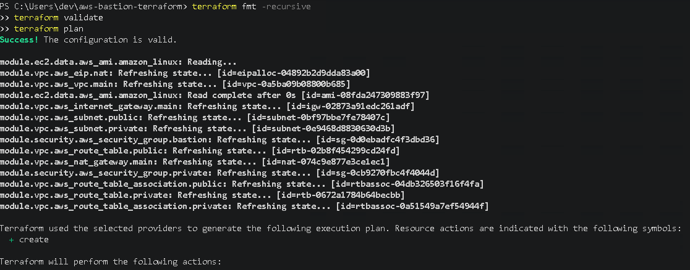
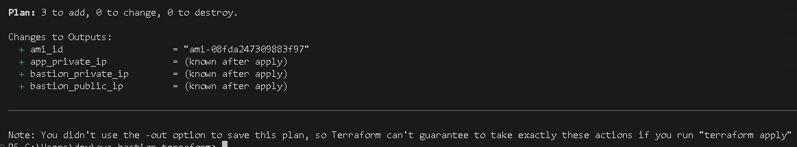
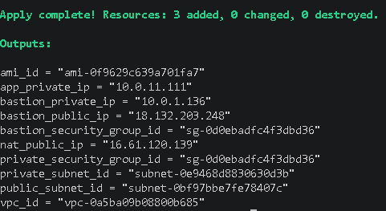
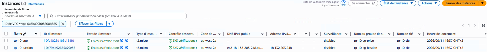
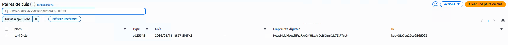
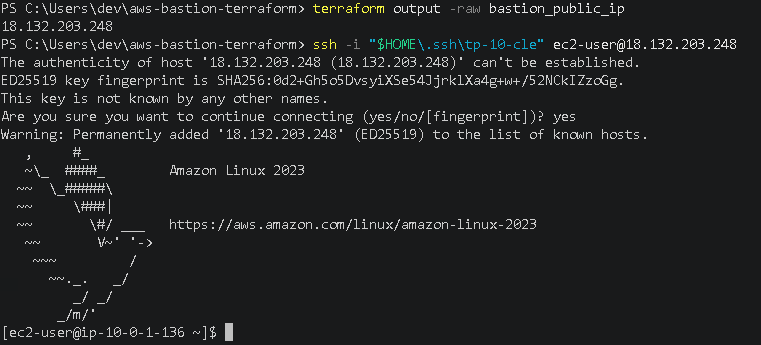
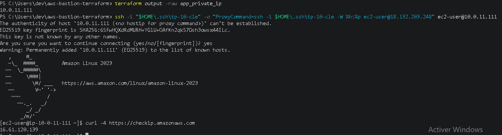
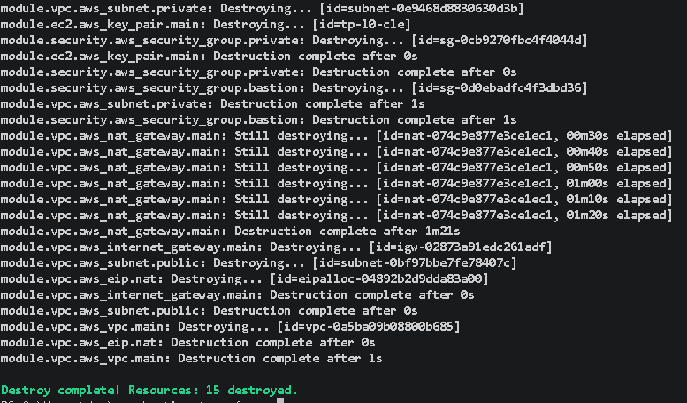

# Preuves de validation — Module EC2

Ce document regroupe les différentes preuves de validation du module Terraform `ec2`.

L'objectif est de vérifier que les instances EC2, la paire de clés SSH et les différents tests de connexion ont bien été réalisés conformément à l'architecture prévue.

---

## 1. Validation de la configuration Terraform

Avant de générer le plan de déploiement, la configuration Terraform a été vérifiée avec :

```powershell
terraform validate
```

Cette commande permet de vérifier que la configuration Terraform est syntaxiquement valide et cohérente.



**Validation : la configuration Terraform du projet est valide.**

---

## 2. Validation du plan Terraform

Avant toute création de ressource, la commande suivante a été exécutée :

```powershell
terraform plan
```

Le plan permet de vérifier les nouvelles ressources que Terraform prévoit de créer.

Pour le module `ec2`, le déploiement comprend notamment :

```text
Paire de clés AWS
Instance bastion
Instance privée
```



**Validation : le plan Terraform prévoit correctement le déploiement des ressources EC2 attendues.**

---

## 3. Déploiement avec Terraform Apply

Après validation du plan, les ressources ont été créées avec :

```powershell
terraform apply
```

Terraform utilise les informations fournies par les modules `vpc` et `security` afin de placer les instances dans les bons sous-réseaux et de leur associer les bons groupes de sécurité.



**Validation : le module EC2 a été déployé correctement.**

---

## 4. Vérification des instances EC2

Deux instances ont été déployées :

```text
tp-10-bastion
tp-10-app
```

### Bastion

L'instance `tp-10-bastion` est placée dans le sous-réseau public.

Elle possède :

```text
Type            : t3.micro
Système         : Amazon Linux
Sous-réseau     : public
IPv4 publique   : oui
Security Group  : tp-10-sg-bastion
```

### Instance privée

L'instance `tp-10-app` est placée dans le sous-réseau privé.

Elle possède :

```text
Type            : t3.micro
Système         : Amazon Linux
Sous-réseau     : privé
IPv4 publique   : non
Security Group  : tp-10-sg-prive
```

La capture suivante permet de vérifier la présence des deux instances ainsi que leur adressage.



**Validation : le bastion possède une adresse IPv4 publique tandis que l'instance applicative reste uniquement accessible sur le réseau privé.**

---

## 5. Vérification de la paire de clés SSH

Une paire de clés SSH est utilisée pour permettre l'authentification sur les instances EC2.

La clé privée reste stockée uniquement sur le poste d'administration :

```text
tp-10-cle
```

La clé publique correspondante est transmise à AWS par Terraform et enregistrée comme paire de clés EC2 :

```text
tp-10-cle
```

La capture suivante permet de vérifier sa présence dans AWS.



**Validation : la clé publique SSH est correctement enregistrée dans AWS tandis que la clé privée reste sur le poste local.**

---

## 6. Vérification de la connexion SSH au bastion

Le bastion constitue le point d'entrée de l'infrastructure.

La connexion est réalisée depuis le poste d'administration avec la clé privée locale.

Exemple de commande :

```powershell
ssh -i "$HOME\.ssh\tp-10-cle" ec2-user@IP_PUBLIQUE_BASTION
```

La capture suivante montre que la connexion SSH au bastion aboutit correctement.



**Validation : le poste d'administration peut se connecter au bastion sur le port SSH.**

---

## 7. Vérification de l'accès à l'instance privée

L'instance `tp-10-app` ne possède aucune adresse IPv4 publique.

Elle ne peut donc pas être jointe directement depuis Internet.

La connexion est effectuée en passant par le bastion :

```text
Poste administrateur
        |
        | SSH
        v
tp-10-bastion
        |
        | SSH
        v
tp-10-app
```

La clé privée reste sur le poste local et n'est pas copiée sur le bastion.

La capture suivante montre la connexion réussie à l'instance privée.



**Validation : l'instance privée est accessible en SSH à travers le bastion sans être directement exposée à Internet.**

---

## 8. Vérification de la sortie Internet depuis le réseau privé

La même session sur l'instance privée a permis de tester sa sortie Internet avec une commande du type :

```bash
curl -4 https://checkip.amazonaws.com
```

L'adresse IPv4 retournée correspond à l'adresse publique utilisée par la NAT Gateway.

Le chemin réseau est donc :

```text
tp-10-app
    |
    v
Table de routage privée
    |
    v
NAT Gateway
    |
    v
Internet Gateway
    |
    v
Internet
```

La capture de connexion à l'instance privée contient également ce test de sortie Internet.


**Validation : l'instance privée peut initier des connexions vers Internet grâce à la NAT Gateway tout en restant dépourvue d'adresse IPv4 publique.**

---

## 9. Vérification du nettoyage Terraform

Une fois les validations terminées, les ressources du projet peuvent être supprimées avec :

```powershell
terraform destroy
```

Terraform calcule les dépendances entre les ressources et les supprime dans l'ordre nécessaire.

La capture suivante montre la destruction de l'infrastructure Terraform.



**Validation : les ressources déployées par Terraform peuvent être supprimées proprement et l'environnement AWS peut être remis dans son état initial.**

---