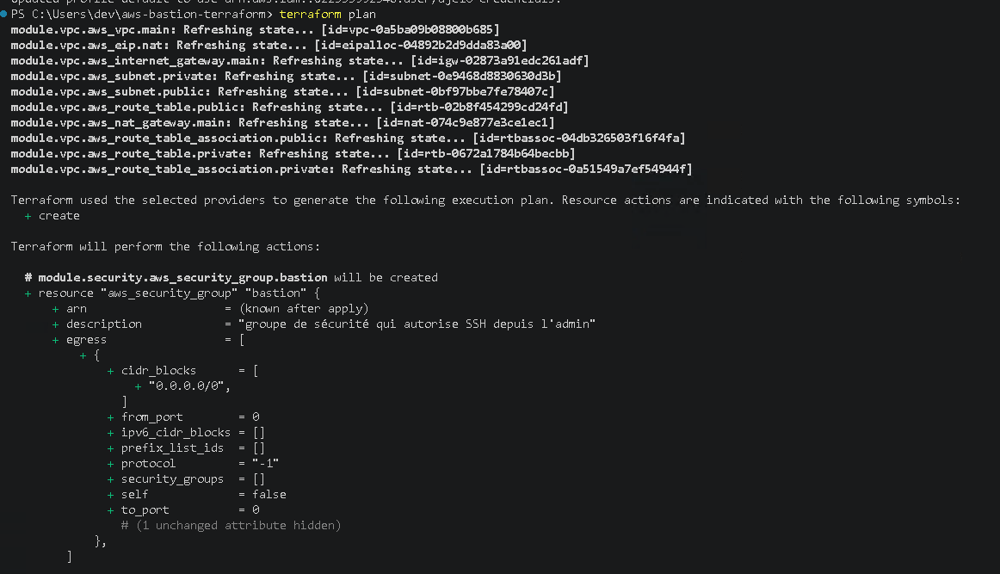
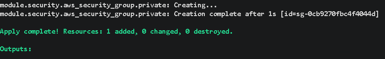
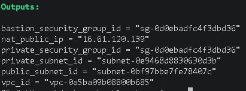
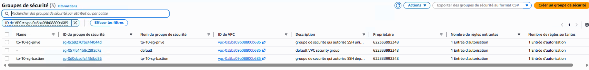

# Preuves de validation — Module Security

Ce document regroupe les différentes preuves de validation du module Terraform `security`.

L'objectif est de vérifier que les groupes de sécurité ont bien été planifiés, déployés et créés dans AWS conformément à l'architecture attendue.

---

## 1. Validation du plan Terraform

Avant le déploiement, la commande suivante a été exécutée :

```powershell
terraform plan
```

Cette commande permet de vérifier les ressources que Terraform prévoit de créer avant leur application sur AWS.

Dans le cas du module `security`, le plan doit notamment prévoir la création des groupes de sécurité :

- `tp-10-sg-bastion`
- `tp-10-sg-prive`



**Validation : Terraform génère correctement le plan du module Security sans erreur bloquante.**

---

## 2. Déploiement avec Terraform Apply

Après validation du plan, le déploiement a été exécuté avec :

```powershell
terraform apply
```

Terraform crée alors les groupes de sécurité définis dans le module.



**Validation : le déploiement du module Security s'est terminé correctement.**

---

## 3. Vérification avec Terraform Output

Une fois le déploiement terminé, la commande suivante permet d'afficher les valeurs de sortie :

```powershell
terraform output
```

Dans le cadre du module `security`, ces outputs permettent notamment de récupérer les identifiants des groupes de sécurité créés.

Exemples attendus :

```text
bastion_security_group_id
private_security_group_id
```

Ces identifiants pourront ensuite être utilisés par le module `ec2`.



**Validation : Terraform fournit bien les identifiants des groupes de sécurité créés.**

---

## 4. Vérification des groupes de sécurité dans AWS

Deux groupes de sécurité ont été créés dans le VPC :

```text
tp-10-sg-bastion
tp-10-sg-prive
```

### Groupe de sécurité du bastion

Le groupe `tp-10-sg-bastion` autorise les connexions SSH entrantes sur le port `22` uniquement depuis l'adresse IP publique du poste d'administration.

Logique attendue :

```text
Source : MON_IP_PUBLIQUE/32
Port   : 22
Proto  : TCP
```

### Groupe de sécurité de l'instance privée

Le groupe `tp-10-sg-prive` autorise les connexions SSH entrantes sur le port `22` uniquement depuis le groupe de sécurité du bastion.

Logique attendue :

```text
Source : tp-10-sg-bastion
Port   : 22
Proto  : TCP
```

Cette architecture évite d'exposer directement l'instance privée à Internet.

Schéma logique :

```text
Poste administrateur
      |
      | SSH TCP/22
      v
tp-10-sg-bastion
      |
      | SSH TCP/22
      v
tp-10-sg-prive
```

La capture suivante permet de vérifier la présence et la configuration des groupes de sécurité dans AWS.



**Validation : les groupes de sécurité sont présents dans AWS et appliquent bien le filtrage attendu.**

---