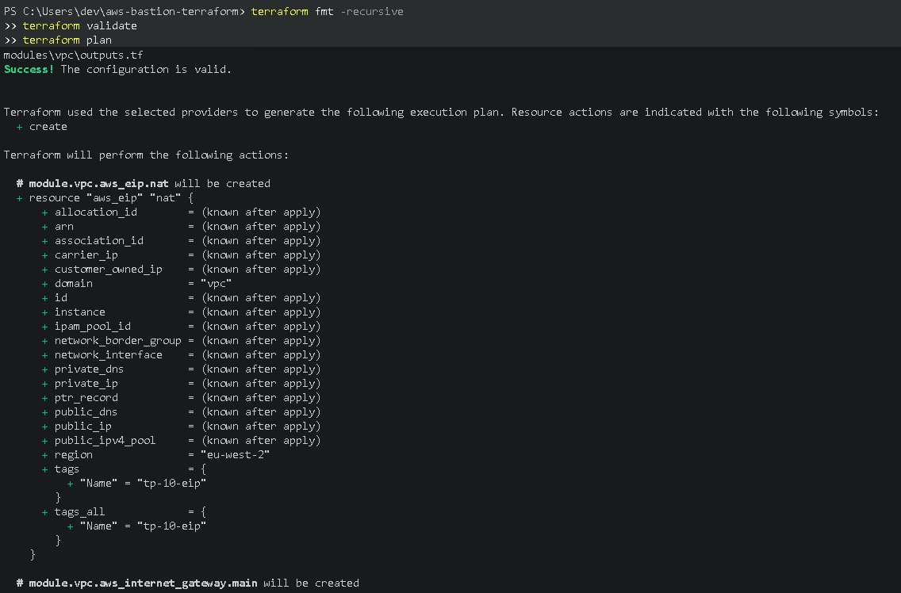
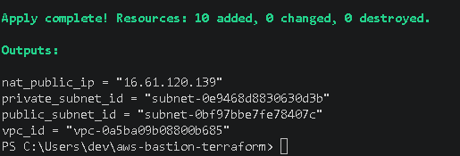
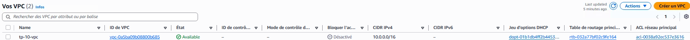
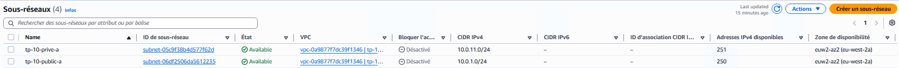
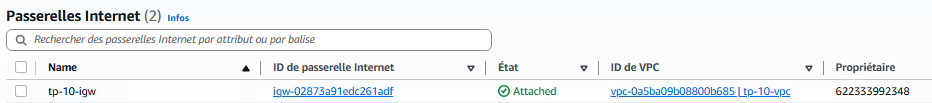
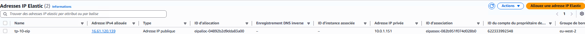
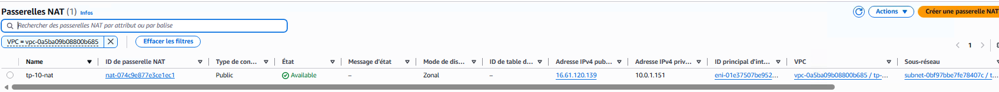
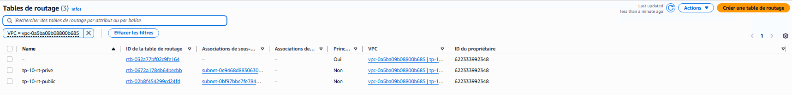

# Preuves de validation — Module VPC

Ce document regroupe les différentes preuves de validation du module Terraform `vpc`.

L'objectif est de vérifier que l'infrastructure réseau définie avec Terraform a bien été planifiée, déployée et créée dans AWS.

---

## 1. Validation du plan Terraform

Avant tout déploiement, la commande suivante a été exécutée :

```powershell
terraform plan
```

Cette commande permet de vérifier les modifications que Terraform prévoit d'appliquer à l'infrastructure avant leur création effective.

La capture suivante montre le résultat du plan Terraform pour le module VPC.



**Validation : Terraform est capable de générer le plan de déploiement de l'infrastructure sans erreur bloquante.**

---

## 2. Déploiement avec Terraform Apply

Après vérification du plan, l'infrastructure a été déployée avec :

```powershell
terraform apply
```

Terraform crée alors les ressources déclarées dans le module VPC.



**Validation : le déploiement Terraform du module VPC s'est terminé correctement.**

---

## 3. Vérification du VPC

Le VPC constitue le réseau principal de l'architecture.

Configuration attendue :

```text
Nom  : tp-10-vpc
CIDR : 10.0.0.0/16
```

La capture suivante permet de vérifier la présence du VPC dans AWS ainsi que sa plage d'adressage.



**Validation : le VPC `tp-10-vpc` est présent dans AWS avec la plage réseau prévue.**

---

## 4. Vérification des sous-réseaux

Le VPC contient deux sous-réseaux :

```text
tp-10-public-a
10.0.1.0/24

tp-10-prive-a
10.0.11.0/24
```

Le premier est destiné aux ressources publiques comme le bastion et la NAT Gateway.

Le second est destiné aux ressources qui ne doivent pas être directement accessibles depuis Internet.



**Validation : les sous-réseaux public et privé sont présents dans le VPC avec les plages CIDR attendues.**

---

## 5. Vérification de l'Internet Gateway

Une Internet Gateway a été créée afin de permettre au réseau public de communiquer avec Internet.

Configuration attendue :

```text
tp-10-igw
```

Elle doit être attachée au VPC `tp-10-vpc`.



**Validation : l'Internet Gateway est créée et associée au VPC.**

---

## 6. Vérification de l'Elastic IP

Une adresse Elastic IP est réservée pour la NAT Gateway.

Cette adresse permet à la NAT Gateway de disposer d'une adresse IPv4 publique stable pour accéder à Internet.



**Validation : une Elastic IP est bien réservée et utilisée par l'infrastructure réseau.**

---

## 7. Vérification de la NAT Gateway

La NAT Gateway est placée dans le sous-réseau public.

Configuration attendue :

```text
tp-10-nat
```

Elle permet aux futures instances du sous-réseau privé d'initier des connexions vers Internet sans posséder elles-mêmes d'adresse IPv4 publique.

Le chemin réseau attendu est :

```text
Instance privée
      |
      v
Table de routage privée
      |
      v
NAT Gateway
      |
      v
Internet Gateway
      |
      v
Internet
```



**Validation : la NAT Gateway est déployée dans le réseau public et dispose d'une adresse publique.**

---

## 8. Vérification des tables de routage

Deux tables de routage personnalisées sont utilisées :

```text
tp-10-rt-public
tp-10-rt-prive
```

### Table de routage publique

Le sous-réseau public utilise une route par défaut vers l'Internet Gateway :

```text
0.0.0.0/0
    |
    v
Internet Gateway
```

### Table de routage privée

Le sous-réseau privé utilise une route par défaut vers la NAT Gateway :

```text
0.0.0.0/0
    |
    v
NAT Gateway
```



**Validation : le routage public passe par l'Internet Gateway tandis que le routage privé passe par la NAT Gateway.**

---